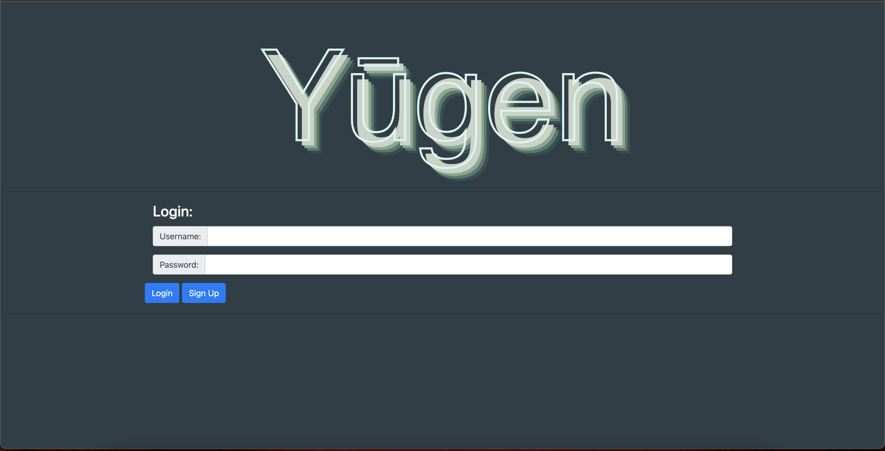

# Yūgen

## Table of Contents

- [Description](#description)
- [Installation](#installation)
- [Deployment](#deployment)
- [Usage](#usage)
- [Question](#questions)

## Description

Yūgen is an application designed to allow a user to create and maintain a travel blog profile.  It connects travel enthusiasts socially, allowing them to post their travels in an 'Adventure Log' and share detailed reviews and pictures with others.  This full stack application functions with the assistance of Mapbox's API which is utilized as a geolocater.  Yūgen also uses mysql2, sequelize, express, handlebars, and bootstrap to enhance functionality and aethestics.

## Installation

After cloning the repository, use my SQL to run server.js.

## Deployment

[Deployed Page](https://peaceful-everglades-19601.herokuapp.com/login)

## Usage

## Questions

[Emily Rose](https://github.com/emilyerose)

[Eric Courter](https://github.com/Amob7)

[Jake McMillan](https://github.com/jakewmcmillan)

[Nate Soum](https://github.com/natesoum)